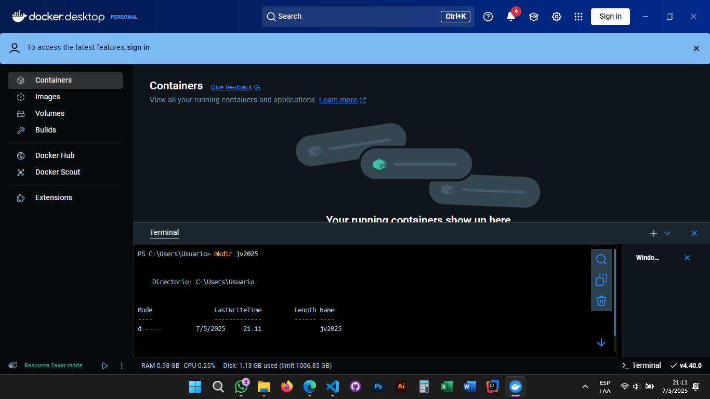
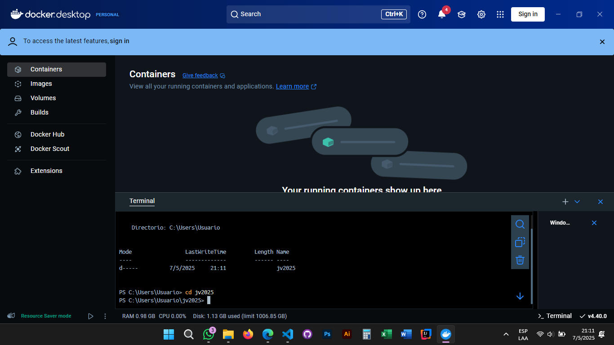
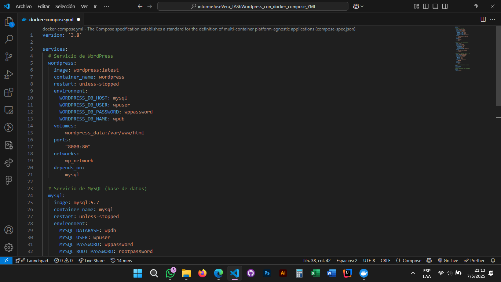
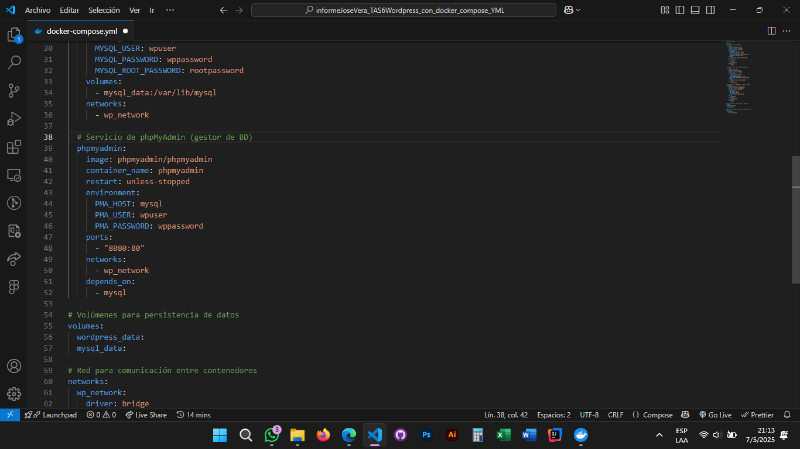
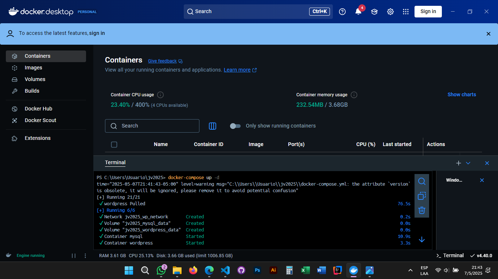
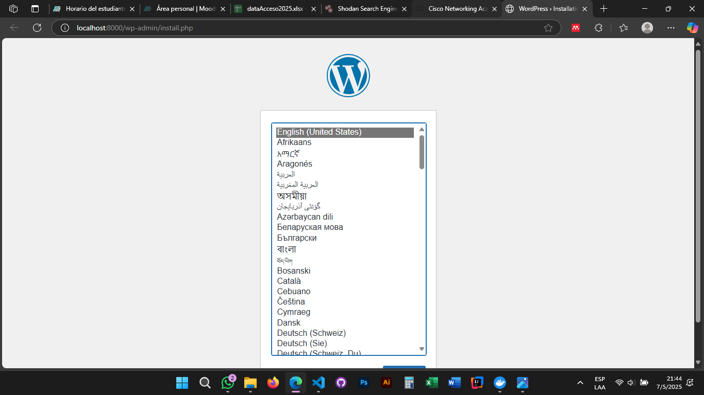

# Practica servidor web
## 1. Título
"TAS6 - Wordpress con docker compose YML"

## 2. Tiempo de duración
25 minutos aproximadamente para desarrollar la práctica.

## 3. Fundamentos:
El despliegue de **WordPress** en conjunto con **MySQL** y **phpMyAdmin**, utilizando **Docker Desktop**, representa una solución tecnológica moderna para la gestión eficiente de entornos web. WordPress, como sistema de gestión de contenidos (CMS), se ha consolidado como la plataforma más utilizada a nivel mundial para la creación de sitios web, gracias a su flexibilidad y extensibilidad (WordPress, 2023). Al integrarlo con MySQL, un sistema de gestión de bases de datos relacionales robusto y confiable, se garantiza un almacenamiento estructurado y seguro de la información del sitio (Oracle, 2022).

La implementación de estos servicios mediante Docker permite crear entornos aislados y portables, optimizando los procesos de desarrollo y despliegue. **Docker Compose**, en particular, simplifica la orquestación de múltiples contenedores a través de un archivo **YAML**, definiendo servicios, redes y volúmenes de manera declarativa (Docker, 2023). Esta metodología no solo asegura la **persistencia de datos**, sino que también facilita la replicación del entorno en diferentes etapas del ciclo de vida del software, desde desarrollo hasta producción (Merkel, 2023).

La inclusión de phpMyAdmin como herramienta de administración gráfica para MySQL añade una capa de usabilidad, permitiendo gestionar la base de datos de manera intuitiva y eficiente (phpMyAdmin, 2023). La configuración de una **red personalizada** en Docker asegura una comunicación segura y eficaz entre los contenedores, mientras que los **volúmenes Docker** garantizan que los datos persistan incluso después de reiniciar los contenedores (Bass et al., 2021).

Este enfoque se alinea con las mejores prácticas de **DevOps**, promoviendo la automatización y la consistencia entre entornos. Estudios recientes destacan que el uso de tecnologías de contenedorización puede reducir significativamente los tiempos de despliegue y minimizar los errores asociados a diferencias entre ambientes (Gartner, 2022). Así, la combinación de WordPress, MySQL, phpMyAdmin y Docker no solo optimiza el desarrollo web, sino que también establece un estándar de eficiencia y confiabilidad en la gestión de proyectos digitales.

## 4. Conocimientos previos.
Para realizar esta practica el estudiante necesita tener claro los siguientes temas:
- Conocimientos sobre el uso de la línea de comandos.
- Fundamentos de Docker (imágenes y contenedores).
- Comandos para crear redes, unir contenedores en red y configuración de aplicaciones en Docker.
- Fundamentos básicos de MySQL, phpMyAdmin y WordPress.

## 5. Objetivos a alcanzar
- Configurar mediante docker-compose.yml un entorno WordPress con MySQL y phpMyAdmin funcional y persistente para desarrollo.

## 6. Equipo necesario:
- Computadora con sistema operativo Windows o Linux.

## 7. Material de apoyo.
- Documentación sobre comandos básicos de Docker (contenedores, imágenes, volúmenes).
- Documentación sobre conceptos fundamentales de bases de datos relacionales y SQL.
- Documentación sobre conexión a PostgreSQL desde terminal o cliente gráfico.
- Documentación sobre uso de MySQL y phpMyAdmin.
- Documentación sobre uso de WordPress.
  
## 8. Procedimiento
### Paso 1: Crear una carpeta para el archivo docker-compose.yml y entrar a ella.

### Paso 2: Crear y codificar el archivo docker-compose.yml.
En el paso 2, estamos incluyendo en la configuración los servicios, imágenes, variables de entorno, puertos expuesto, volúmenes y red necesarios para su uso.

### Paso 3: Ejecutar el archivo docker-compose.yml.

### Paso 4: Visualización final de WordPress en navegador.

## 9. Resultados esperados:
La configuración en Docker funcionó correctamente, permitiendo acceder a WordPress en el puerto 8000 y a phpMyAdmin en el 8080. Los datos se mantuvieron persistentes y los contenedores se comunicaron sin problemas, confirmando que el entorno quedó listo para desarrollo.

## 10. Bibliografía
- Bass, L., Weber, I., & Zhu, L. (2021). DevOps: A software architect’s perspective. Addison-Wesley.
- Docker. (2023). Docker Compose documentation. https://docs.docker.com/compose/
- Gartner. (2022). Market guide for container management software. Gartner Research.
- Merkel, D. (2023). Docker: Up & running. O’Reilly Media.
- Oracle. (2022). MySQL 8.0 Reference Manual. Oracle Corporation.
- phpMyAdmin. (2023). Official documentation. https://www.phpmyadmin.net/docs/
- WordPress. (2023). About WordPress. https://wordpress.org/about/